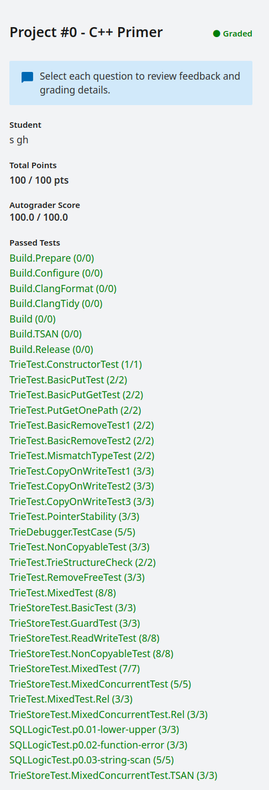

<!--
 * @Author: s
 * @Date: 2024-01-07 18:43:14
 * @LastEditTime: 2024-01-19 14:49:20
 * @LastEditors: s
 * @Description: 
 * @FilePath: /self-salvation/CMU-15-445/project0/record.md
-->
# Project #0 - C++ Primer

该项目主要考验Mordern C++的新要求，主要用于学习提交流程、CTest和debug操作

    
     
    
提交结果

