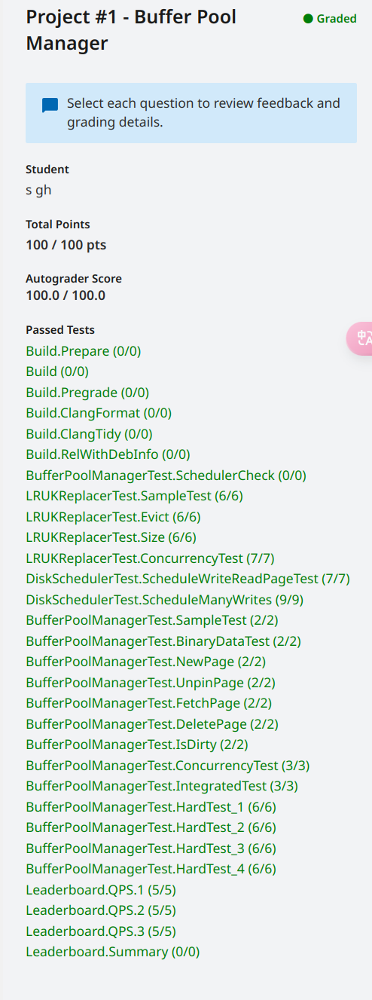

<!--
 * @Author: s
 * @Date: 2024-01-19 14:49:00
 * @LastEditTime: 2024-01-19 16:15:31
 * @LastEditors: s
 * @Description: 
 * @FilePath: /self-salvation/CMU-15-445/project1/record.md
-->
# Project #1 - Buffer Pool Manager

- 这一章节总体上不难但还是做了很长时间，主要的时间花费在了Debug上，bug造成的原因是没有完全依照注释要求完成函数导致了一个FetchPage的错误，但造成错误的根源不在FetchPage而是由于RecordAccess与测试例子中不规范造成的，随后分析原因
  
## Task #1 - LRU-K Replacement Policy

- 这一任务要求完成LRU-K算法，详细的可以参见[算法论文](https://www.cs.cmu.edu/~natassa/courses/15-721/papers/p297-o_neil.pdf)，简单来说就是查询前K次访问的时间来确定需要换出的页，若页访问不满K次优先换出，并根据其他算法决定要换出的页(作业中为FIFO)，在课程页面中提到了建议对这一部分进行优化，包括更改LRU-K算法留存热点页面等，优化等到完成所以project再去，这里简单的以两个红黑树（std::map）存储满足K与不满足K的页面，这样每次选择换出页面，删除换出页面，更改换出页面的时间复杂度均为log(n)，完成后看他人实现有使用两个链表来进行存储两种页面，后面可以尝试一下。

## Task #2 - Disk Scheduler

- 这一任务主要考验std::promise和std::future这两种函数的使用，优化建议中也提到可以实现并行的IO，目前的想法是如果Unpine标记了脏页面，且Pine_count = 0时可以考虑直接进行IO，future留待下一次需要换出该页面时使用，这就减少了一部分页面IO时间。

## Task #3 - Buffer Pool Manager

- 这一部分是p1中最难的部分需要实现的函数比较多，这一部分Debug也花了许多时间，最后在Discord找到了答案，由于要求中Unpine不需要进行RecordAccess但我没有仔细看，以自己的想法进行实现导致了错误，其问题在于测试用例中一个测试中一个页面修改了数据，但UnPine并不将其标记为脏页面，如果不进行RecordAccess，该页面不会被换出，而进行RecordAccess后该页面就会被换出，而修改过的数据没有回写，再次Fetch时导致错误。这个错误调试了三天，今后任务需要仔细研究所需要求。

## 提交结果与排行榜

- 目前仅仅做了一些简单优化，完成所有作业后尝试深度优化，如果做了且效果怕明显的话完成后也会更新在后面

    
     
    
提交结果

    
     
    
排行榜

