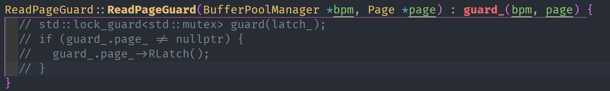
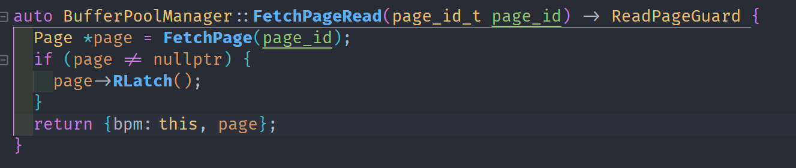
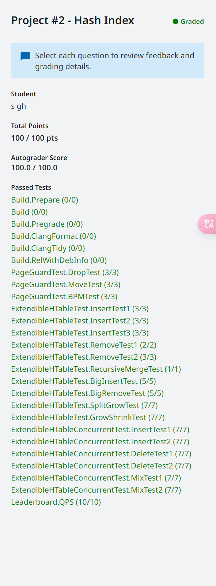
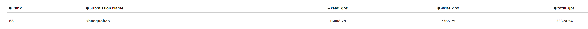

# PROJECT #2 - EXTENDIBLE HASH INDEX

- 这章作业在p吸取project1教训之后，认真阅读相关注释与说明，debug任务简单不少，加上2023新加入的page_guard多线程下调试也没有花费太多时间。

## Task #1 - Read/Write Page Guards

- 这里主要考察读写锁、raii与move构造函数、这里比较坑的一点是，之前我是在page_guard构造函数内部进行锁的获取，但是这种写法在测试中会导致死锁，没找到具体的死锁原因，但将锁的获取时机放在FetchPage之中
就没有这个问题，后续可以查找相关资料查找相关的原因。

    
     
    
以前的加锁时间

    
     
    
现在的加锁时间

- 之前的加锁时间是在之前构造函数中也有一些别的操作，这里是随便找了一个版本
  
## Task #2 - Extendible Hash Table Pages

## Task #3 - Extendible Hashing Implementation

## Task #4 - Concurrency Control

- 这三个任务均为实现extendible hash table这一数据结构具体形状如下图

    
     
    
extendible-htable-structure

- 其中要注意的点就是需要扩展桶和收缩桶的时间，并保证满足
(1) All LD <= GD.
(2) Each bucket has precisely 2^(GD - LD) pointers pointing to it.
(3) The LD is the same at each index with the same bucket_page_id
- 这部分花了一点时间

## 提交结果与排行榜

    
     
    
提交结果

    
     
    
排行榜

- 这次性能测试不是很理想，目前能想到的优化方案有
  - 1. 优化页面读写锁，目前的锁在多线程下表现与单线程完全一致，优化读写锁可以提高读写性能
  - 2. 考虑使用backen线程完成桶的更新，减少主线程使用相关功能的时间
- 这些任务仍放在完成所有任务之后